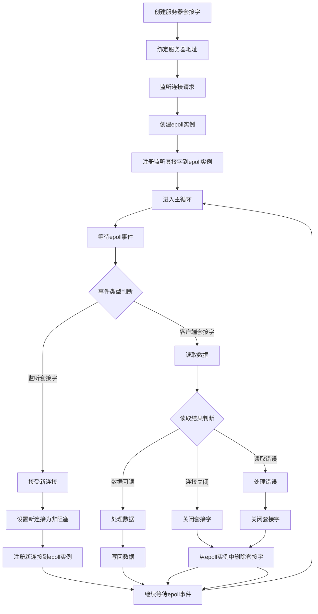
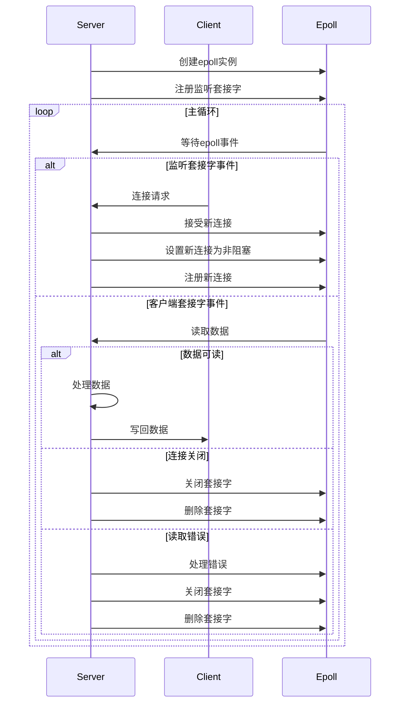
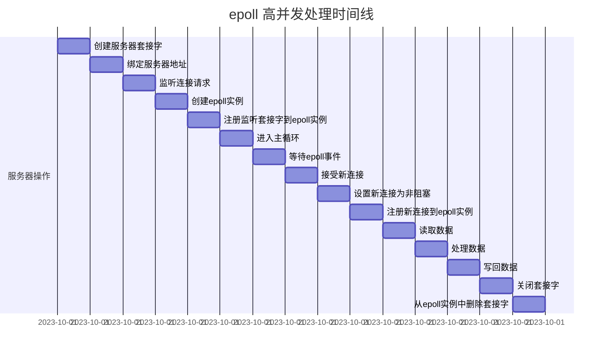
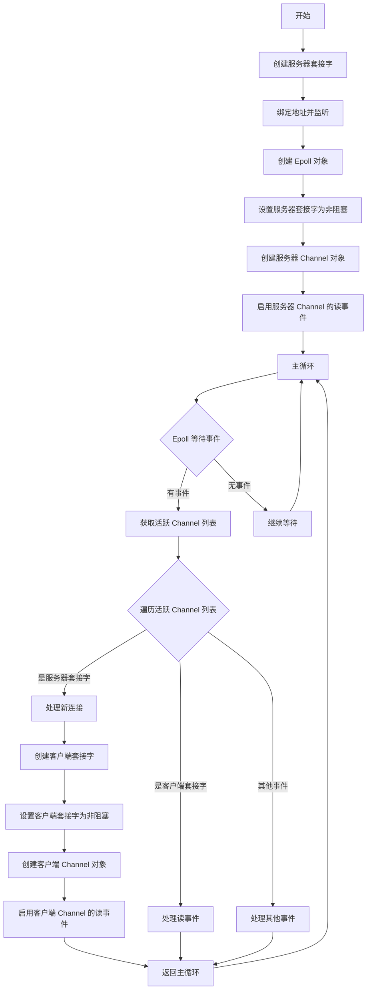

# 30dayMakeCppServer

## 简介

根据 github [Wlgls/30daysCppWebServer](https://github.com/Wlgls/30daysCppWebServer) 学习并记录实现过程

## day1

简单实现 socket，通过设置 server 与 client 实现简单通信

-   socket
    通过使用<sys/socket.h>实现 socket

    ```cpp
    //server端
    // 1. 创建socket
    int server_socket = socket(AF_INET, SOCK_STREAM, 0);
    // 2. 创建serverSocket地址
    struct socketaddr_in server_addr;
    // 清空地址内容
    bzero(&server_addr, sizeof(server_addr));
    // 设置地址内容
    server_addr.sin_family = AF_INET;
    server_addr.sin_addr.s_addr = inet_addr("127.0.0.1");
    server_addr.sin_port = htons(8883);
    // 3. 绑定socket地址
    bind(server_socket, (sockaddr*)&server_addr, sizeof(server_addr));
    // 设置client地址
    struct sockaddr_in client_addr;
    // 4. 监听并读取数据
    listen(server_socket, SOMAXCONN);
    read(accpet(server_socket, (sockaddr*)&client_addr, sizeof(client_addr)));

    char buf[1024];
    bzero(buf, sizeof(buf));
    // 5. 写入数据
    printf("message from client: %s\n", write(clnet_socket, buf, sizeof(buf)));

    ```

    server 端主要为 创建 socket->绑定 socket 地址->监听并读取数据->写入数据.

    ```cpp
    //client端
    // 1. 创建socket
    int client_socket = socket(AF_INET, SOCK_STREAM, 0);
    struct sockaddr_in client_addr;
    bzero(&client_addr, sizeof(client_addr));
    // 2. 设置client地址
    client_addr.sin_family = AF_INET;
    client_addr.sin_ddr.s_addr = inet_addr("127.0.0.1");
    client_addr.sin_port = htons(8883);
    // 3. 连接server端
    connect(client_socket, (sockaddr*)&client_addr, sizeof(client_addr));

    char buf[1024];
    bzero(buf, sizeof(buf));
    // 4. 写入数据
    scanf("%s", buf);
    write(client_socket, buf, sizeof(buf));

    // 5. 读取数据
    read(client_socket, buf, sizeof(buf));
    printf("message from server: %s\n", buf);

    // 6. 关闭socket
    close(client_socket);

    ```
    client 端主要为 创建 socket->设置 client 地址->连接 server 端->写入数据->读取数据->关闭 socket.

## day2
实现错误处理
编写utils.h和utils.cpp，将错误处理封装为函数
```cpp
//utils.h
void error(bool status, const char* errmsg);

```

```cpp
//utils.cpp
void error(bool status, const char* errmsg) {
    // 打印错误信息
    perror(errmsg);
    // 退出程序
    exit(EXIT_FAILURE);
}

```

## day3
实现高并发
通过使用epoll实现高并发

> 使用通义灵码生成uml图来描述这一过程

时序图

甘特图


## day4
将之前的代码封装成类，分别为Epoll,Socket,InetAddr,Socket.

-  **bug**
    
    - 在wsl2上使用clangd的进行编译时出现一个问题，无法正确引入cpp头文件
        wsl环境为
        ```
        Distributor ID: Ubuntu
        Description:    Ubuntu 22.04.5 LTS
        Release:        22.04
        Codename:       jammy
        ```
        在安装g++12后解决
        ```
        sudo apt install g++-12
        ```
        <!-- 参考[clang++ cannot find iostream](https://askubuntu.com/questions/1449769/clang-cannot-find-iostream) -->
    - 设置套接字非阻塞模式出错
        ```cpp
        //正确设置
        void Socket::setnonblocking() {
        fcntl(fd, F_SETFL, fcntl(fd, F_GETFL) | O_NONBLOCK);
        }
        
        //错误设置
        void Socket::setnonblocking() {
        fcntl(fd, F_SETFL, fcntl(fd, F_GETFL | O_NONBLOCK));
        }
        ```


## day5
创建Channel类封装文件描述符事件处理。

>加入Channel后处理流程
