# 30dayMakeCppServer

## 简介

根据 github [Wlgls/30daysCppWebServer](https://github.com/Wlgls/30daysCppWebServer) 学习并记录实现过程

## day1

简单实现 socket，通过设置 server 与 client 实现简单通信

-   socket
    通过使用<sys/socket.h>实现 socket

    ```cpp
    //server端
    // 1. 创建socket
    int server_socket = socket(AF_INET, SOCK_STREAM, 0);
    // 2. 创建serverSocket地址
    struct socketaddr_in server_addr;
    // 清空地址内容
    bzero(&server_addr, sizeof(server_addr));
    // 设置地址内容
    server_addr.sin_family = AF_INET;
    server_addr.sin_addr.s_addr = inet_addr("127.0.0.1");
    server_addr.sin_port = htons(8883);
    // 3. 绑定socket地址
    bind(server_socket, (sockaddr*)&server_addr, sizeof(server_addr));
    // 设置client地址
    struct sockaddr_in client_addr;
    // 4. 监听并读取数据
    listen(server_socket, SOMAXCONN);
    read(accpet(server_socket, (sockaddr*)&client_addr, sizeof(client_addr)));

    char buf[1024];
    bzero(buf, sizeof(buf));
    // 5. 写入数据
    printf("message from client: %s\n", write(clnet_socket, buf, sizeof(buf)));

    ```

    server 端主要为 创建 socket->绑定 socket 地址->监听并读取数据->写入数据.

    ```cpp
    //client端
    // 1. 创建socket
    int client_socket = socket(AF_INET, SOCK_STREAM, 0);
    struct sockaddr_in client_addr;
    bzero(&client_addr, sizeof(client_addr));
    // 2. 设置client地址
    client_addr.sin_family = AF_INET;
    client_addr.sin_ddr.s_addr = inet_addr("127.0.0.1");
    client_addr.sin_port = htons(8883);
    // 3. 连接server端
    connect(client_socket, (sockaddr*)&client_addr, sizeof(client_addr));

    char buf[1024];
    bzero(buf, sizeof(buf));
    // 4. 写入数据
    scanf("%s", buf);
    write(client_socket, buf, sizeof(buf));

    // 5. 读取数据
    read(client_socket, buf, sizeof(buf));
    printf("message from server: %s\n", buf);

    // 6. 关闭socket
    close(client_socket);

    ```
    client 端主要为 创建 socket->设置 client 地址->连接 server 端->写入数据->读取数据->关闭 socket.

## day2
实现错误处理
编写utils.h和utils.cpp，将错误处理封装为函数
```cpp
//utils.h
void error(bool status, const char* errmsg);

```

```cpp
//utils.cpp
void error(bool status, const char* errmsg) {
    // 打印错误信息
    perror(errmsg);
    // 退出程序
    exit(EXIT_FAILURE);
}

```

## day3
实现高并发
通过使用epoll实现高并发

> 使用通义灵码生成uml图来描述这一过程
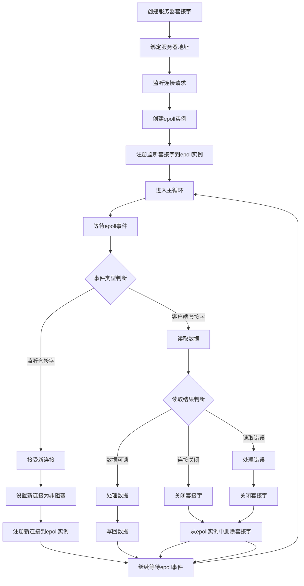
```mermaid


graph TD
    A[创建服务器套接字] --> B[绑定服务器地址]
    B --> C[监听连接请求]
    C --> D[创建epoll实例]
    D --> E[注册监听套接字到epoll实例]
    E --> F[进入主循环]
    F --> G[等待epoll事件]
    G --> H{事件类型判断}
    H -->|监听套接字| I[接受新连接]
    I --> J[设置新连接为非阻塞]
    J --> K[注册新连接到epoll实例]
    K --> L[继续等待epoll事件]
    H -->|客户端套接字| M[读取数据]
    M --> N{读取结果判断}
    N -->|数据可读| O[处理数据]
    O --> P[写回数据]
    P --> L
    N -->|连接关闭| Q[关闭套接字]
    Q --> R[从epoll实例中删除套接字]
    R --> L
    N -->|读取错误| S[处理错误]
    S --> T[关闭套接字]
    T --> R
    R --> L
    L --> F
```
时序图
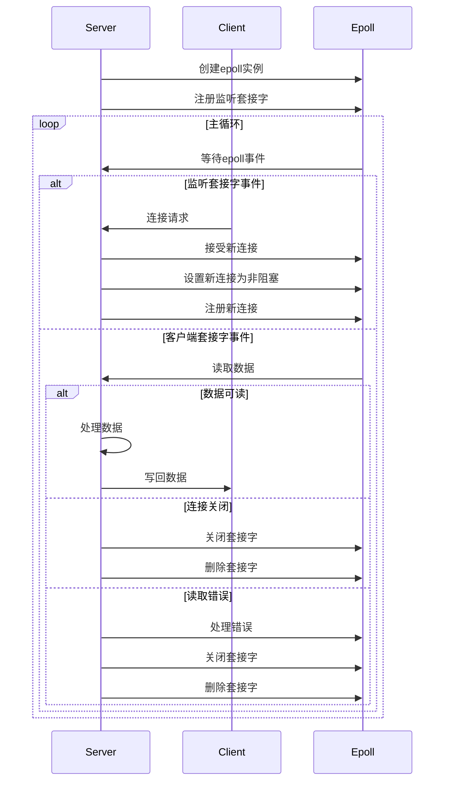
```mermaid


sequenceDiagram
    participant Server
    participant Client
    participant Epoll

    Server->>Epoll: 创建epoll实例
    Server->>Epoll: 注册监听套接字
    loop 主循环
        Epoll->>Server: 等待epoll事件
        alt 监听套接字事件
            Client->>Server: 连接请求
            Server->>Epoll: 接受新连接
            Server->>Epoll: 设置新连接为非阻塞
            Server->>Epoll: 注册新连接
        else 客户端套接字事件
            Epoll->>Server: 读取数据
            alt 数据可读
                Server->>Server: 处理数据
                Server->>Client: 写回数据
            else 连接关闭
                Server->>Epoll: 关闭套接字
                Server->>Epoll: 删除套接字
            else 读取错误
                Server->>Epoll: 处理错误
                Server->>Epoll: 关闭套接字
                Server->>Epoll: 删除套接字
            end
        end
    end

```
甘特图
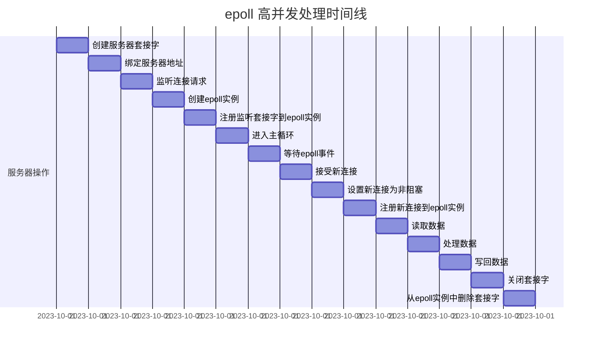
```mermaid
gantt
    title epoll 高并发处理时间线
    dateFormat  YYYY-MM-DD HH:mm:ss
    section 服务器操作
    创建服务器套接字         :a1, 2023-10-01 00:00:00, 1s
    绑定服务器地址           :a2, after a1, 1s
    监听连接请求             :a3, after a2, 1s
    创建epoll实例            :a4, after a3, 1s
    注册监听套接字到epoll实例 :a5, after a4, 1s
    进入主循环               :a6, after a5, 1s
    等待epoll事件            :a7, after a6, 1s
    接受新连接               :a8, after a7, 1s
    设置新连接为非阻塞       :a9, after a8, 1s
    注册新连接到epoll实例    :a10, after a9, 1s
    读取数据                 :a11, after a10, 1s
    处理数据                 :a12, after a11, 1s
    写回数据                 :a13, after a12, 1s
    关闭套接字               :a14, after a13, 1s
    从epoll实例中删除套接字  :a15, after a14, 1s

```

## day4
将之前的代码封装成类，分别为Epoll,Socket,InetAddr,Socket.

-  **bug**
    
    - 在wsl2上使用clangd的进行编译时出现一个问题，无法正确引入cpp头文件
        wsl环境为
        ```
        Distributor ID: Ubuntu
        Description:    Ubuntu 22.04.5 LTS
        Release:        22.04
        Codename:       jammy
        ```
        在安装g++12后解决
        ```
        sudo apt install g++-12
        ```
        <!-- 参考[clang++ cannot find iostream](https://askubuntu.com/questions/1449769/clang-cannot-find-iostream) -->
    - 设置套接字非阻塞模式出错
        ```cpp
        //正确设置
        void Socket::setnonblocking() {
        fcntl(fd, F_SETFL, fcntl(fd, F_GETFL) | O_NONBLOCK);
        }
        
        //错误设置
        void Socket::setnonblocking() {
        fcntl(fd, F_SETFL, fcntl(fd, F_GETFL | O_NONBLOCK));
        }
        ```


## day5
创建Channel类封装文件描述符事件处理。

>加入Channel后处理流程
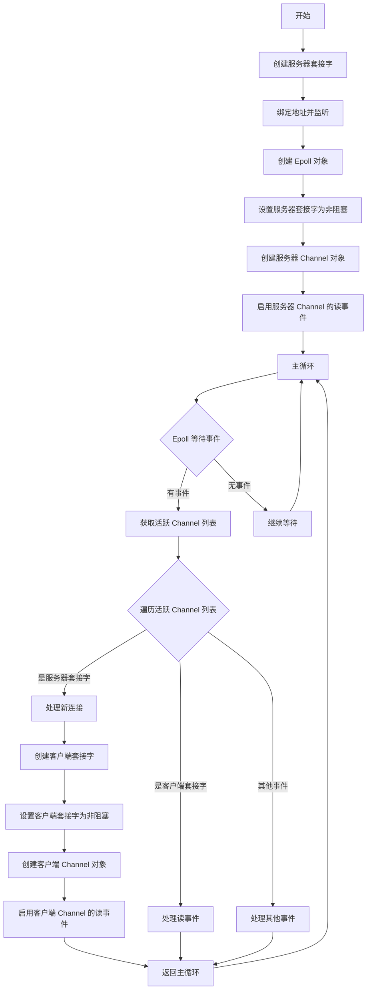
```mermaid
flowchart TD
    A[开始] --> B[创建服务器套接字]
    B --> C[绑定地址并监听]
    C --> D[创建 Epoll 对象]
    D --> E[设置服务器套接字为非阻塞]
    E --> F[创建服务器 Channel 对象]
    F --> G[启用服务器 Channel 的读事件]
    G --> H[主循环]
    H --> I{Epoll 等待事件}
    I -->|有事件| J[获取活跃 Channel 列表]
    J --> K{遍历活跃 Channel 列表}
    K -->|是服务器套接字| L[处理新连接]
    K -->|是客户端套接字| M[处理读事件]
    K -->|其他事件| N[处理其他事件]
    L --> O[创建客户端套接字]
    O --> P[设置客户端套接字为非阻塞]
    P --> Q[创建客户端 Channel 对象]
    Q --> R[启用客户端 Channel 的读事件]
    R --> S[返回主循环]
    M --> S[返回主循环]
    N --> S[返回主循环]
    S --> H
    I -->|无事件| T[继续等待]
    T --> H
```

## day06
重构代码，添加Eventloop和server类实现服务器功能
代码流程为
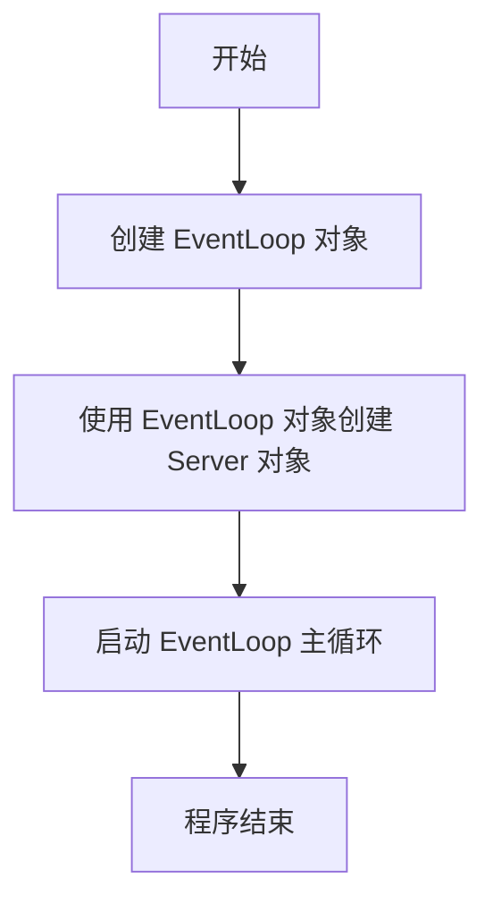
```mermaid
flowchart TD
    A[开始] --> B[创建 EventLoop 对象]
    B --> C[使用 EventLoop 对象创建 Server 对象]
    C --> D[启动 EventLoop 主循环]
    D --> E[程序结束]
```
在LOOP中为
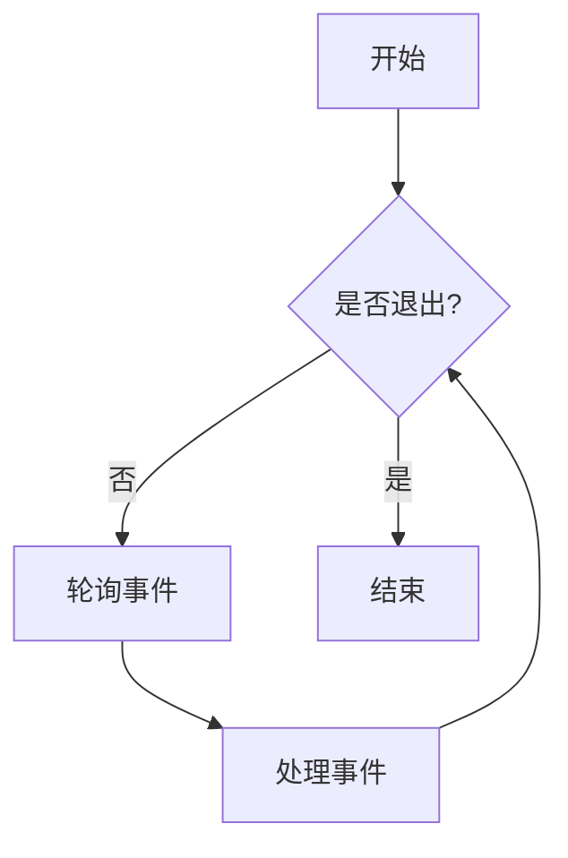
```mermaid
flowchart TD
    A[开始] --> B{是否退出?}
    B -->|否| C[轮询事件]
    C --> D[处理事件]
    D --> B
    B -->|是| E[结束]
```

- 总结
  回调函数理解还不行
  Server.cpp loop()函数中
  ```cpp
    std::function<void()> cb = std::bind(&Server::newConnection, this ,serv_sock);
    servChannel->setCallback(cb);
    servChannel->enableReading();
  ```
  newConnection()函数
  ```cpp
    auto cb= std::bind(&Server::handleReadEvent, this, clnt_sock->getFd());
    clntChannel->setCallback(cb);
    clntChannel->enableReading();
  ```
  类图描述
  ```mermaid
    classDiagram
    class Server {
        +start()
        +handleReadEvent(int fd)
        +handleWriteEvent(int fd)
    }

    class EventLoop {
        +loop()
        +runInLoop(Functor cb)
    }

    class Channel {
        +setReadCallback(Functor cb)
        +setWriteCallback(Functor cb)
        +handleEvent()
    }

    class Functor {
        +operator()()
    }

    Server --> EventLoop : "创建并使用"
    Server --> Channel : "创建并使用"
    Channel --> EventLoop : "注册事件"
    Channel --> Functor : "设置回调"
    EventLoop --> Channel : "调用回调"
  ```
  
## day07
将server类中socket初始化设置抽象出Acceptor类

>Acceptor运行流程
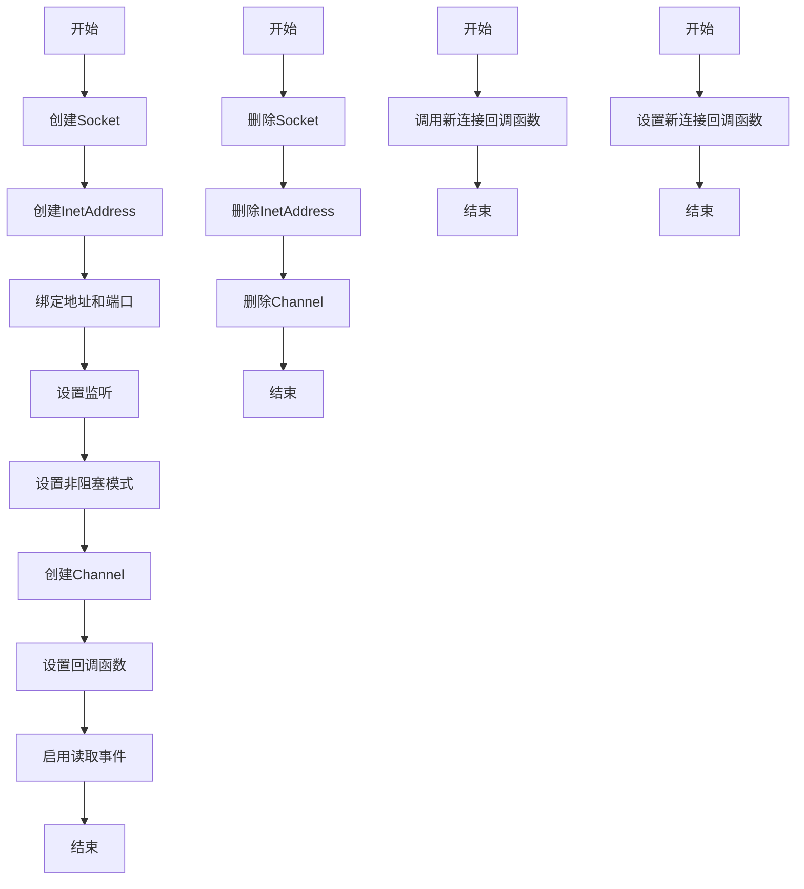
```mermaid
flowchart TD
    A[开始] --> B[创建Socket]
    B --> C[创建InetAddress]
    C --> D[绑定地址和端口]
    D --> E[设置监听]
    E --> F[设置非阻塞模式]
    F --> G[创建Channel]
    G --> H[设置回调函数]
    H --> I[启用读取事件]
    I --> J[结束]

    K[开始] --> L[删除Socket]
    L --> M[删除InetAddress]
    M --> N[删除Channel]
    N --> O[结束]

    P[开始] --> Q[调用新连接回调函数]
    Q --> R[结束]

    S[开始] --> T[设置新连接回调函数]
    T --> U[结束]

```

## day08
修改较多分离Acceptor，新的连接逻辑在Server，Channel控制资源释放，InetAddress修改，地址端口设为privet，怎加获取方法。为适应InetAddress修改，Server类中修改Bind与accept函数。Epoll类中adFd删除

新加Connection类处理链接操作（消息回复）
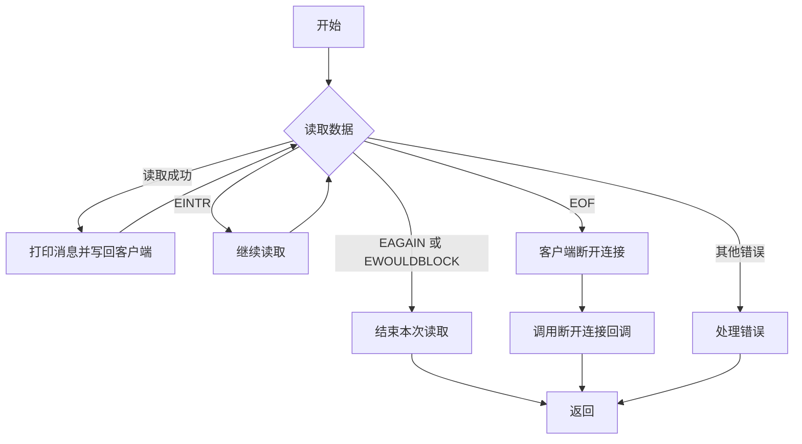
```mermaid
flowchart TD
    A[开始] --> B{读取数据}
    B -->|读取成功| C[打印消息并写回客户端]
    C --> B
    B -->|EINTR| D[继续读取]
    D --> B
    B -->|EAGAIN 或 EWOULDBLOCK| E[结束本次读取]
    E --> F[返回]
    B -->|EOF| G[客户端断开连接]
    G --> H[调用断开连接回调]
    H --> F
    B -->|其他错误| I[处理错误]
    I --> F
```
## day09
添加缓冲池Buffer,主要在Connection内echo中缓冲socket数据

- class内成员变量初始化顺序按照声明顺序
   在 C++ 中，成员变量的初始化顺序是按照它们在类中声明的顺序进行的，而不是按照构造函数初始化列表中的顺序。因此，为了消除编译器的警告，需要确保初始化列表中的顺序与类定义中的声明顺序一致。这样可以避免潜在的未定义行为。

Buffer控制流图
apeend()函数
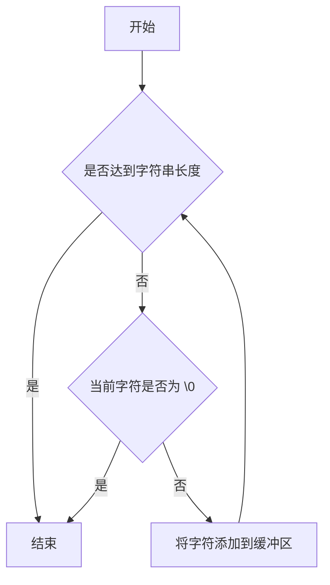
```mermaid
flowchart TD
    Start[开始] --> A{是否达到字符串长度}
    A -->|是| End[结束]
    A -->|否| B{当前字符是否为 \0}
    B -->|是| End
    B -->|否| C[将字符添加到缓冲区]
    C --> A

```
getline()函数
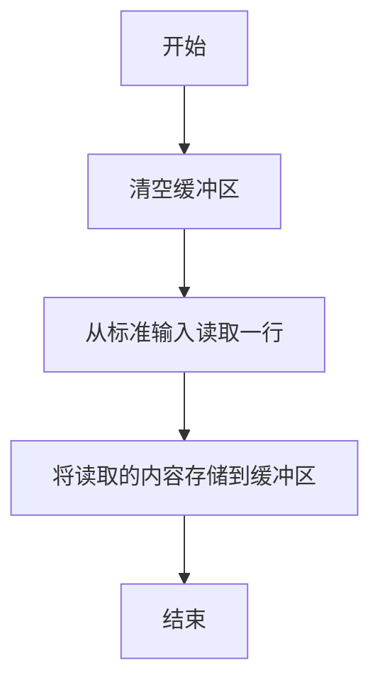
```mermaid
flowchart TD
    Start[开始] --> A[清空缓冲区]
    A --> B[从标准输入读取一行]
    B --> C[将读取的内容存储到缓冲区]
    C --> End[结束]
```
完整控制流图
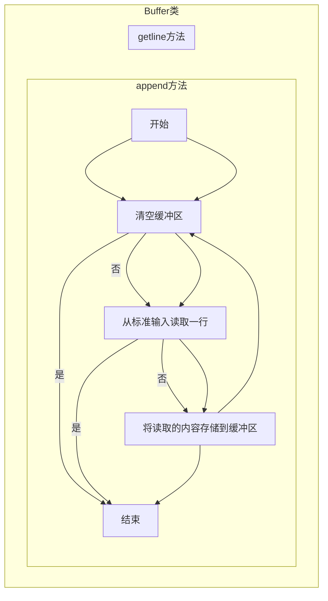
```mermaid
flowchart TB
    subgraph Buffer类
        subgraph append方法
            Start[开始] --> A{是否达到字符串长度}
            A -->|是| End[结束]
            A -->|否| B{当前字符是否为 \0}
            B -->|是| End
            B -->|否| C[将字符添加到缓冲区]
            C --> A
        end
        subgraph getline方法
            Start[开始] --> A[清空缓冲区]
            A --> B[从标准输入读取一行]
            B --> C[将读取的内容存储到缓冲区]
            C --> End[结束]
        end
    end
```

## day10
添加线程池,实现多线程处理

- 线程池
  1. 初始化线程池：
    - 创建一个固定大小的线程池，每个线程都在一个无限循环中等待任务。
    - 初始化任务队列，用于存放待处理的任务。
  2. 任务提交：
    - 提供一个接口（如 submit 方法），允许外部代码向线程池提交任务。
    - 将任务添加到任务队列中。
  3. 任务分配：
    - 线程池中的每个线程不断检查任务队列，如果有任务，则取出任务并执行。
    - 使用互斥锁和条件变量确保任务队列的线程安全。
  4. 任务执行：
    - 线程从任务队列中取出任务并执行。
    - 执行完成后，线程继续检查任务队列，等待下一个任务。
  5. 线程管理：
    - 管理线程的生命周期，包括启动、停止和销毁线程。
    - 提供停止线程池的方法，确保所有任务执行完毕后再销毁线程。
  6. 异常处理：
    - 处理任务执行过程中可能出现的异常，确保线程池的稳定性和可靠性。

ThreadPool类控制流图
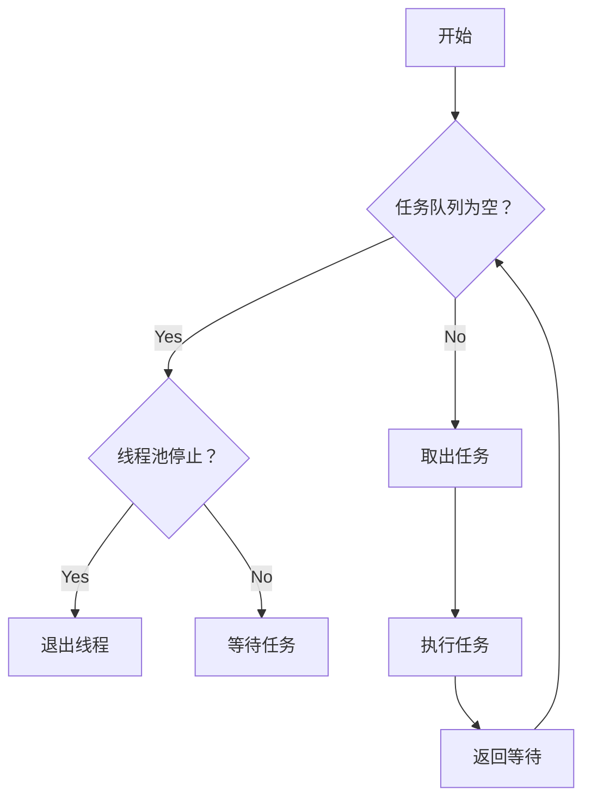
```mermaid
flowchart TD
    A[开始] --> B{任务队列为空？}
    B -->|Yes| C{线程池停止？}
    C -->|Yes| D[退出线程]
    C -->|No| E[等待任务]
    B -->|No| F[取出任务]
    F --> G[执行任务]
    G --> H[返回等待]
    H --> B
```

## day11
完善线程池,使用template在ThreadPool中添加线程池模板.使用了很多c++11特性，如lambda表达式，auto类型推导等。
添加多线程测试程序

在ThreadPool.h中用到了很多c++11新特性
  1. auto关键字：用于让编译器自动推导变量的类型。
  1. std::make_shared：用于创建一个std::shared_ptr，指向一个std::packaged_task对象，从而避免了额外的内存分配。
  1. std::bind：用于绑定可调用对象及其参数，创建一个新的可调用对象。
  1. std::forward：用于完美转发参数，保持参数的左值或右值属性。
  1. std::future：用于获取异步任务的结果。
  1. std::result_of：用于获取可调用对象的返回类型。
  1. std::unique_lock：用于管理互斥锁，提供了更灵活的锁定机制。
  1. std::mutex：用于保护共享数据，确保线程安全。
  1. std::condition_variable：用于线程间的通信，允许线程等待某个条件的发生。
  1. emplace：用于在容器内部构造对象，避免了额外的拷贝或移动操作。
```c++
template <class F, class... Args>
auto ThreadPool::add(F &&f, Args &&...args)
    -> std::future<typename std::result_of<F(Args...)>::type> {
  // 使用auto关键字让编译器自动推导返回类型
  using return_type = typename std::result_of<F(Args...)>::type;

  // 使用std::make_shared创建一个shared_ptr，指向一个packaged_task对象
  // packaged_task包装了一个可调用对象（这里是lambda表达式）
  auto task = std::make_shared<std::packaged_task<return_type()>>(
      std::bind(std::forward<F>(f), std::forward<Args>(args)...));

  // 获取packaged_task的future对象，用于获取任务的结果
  std::future<return_type> res = task->get_future();
  {
    // 使用std::unique_lock来管理互斥锁，确保线程安全
    std::unique_lock<std::mutex> lock(tasks_mtx);

    // 检查线程池是否已经停止
    if (stop) {
      throw std::runtime_error("enqueue on stopped ThreadPool");
    }

    // 使用emplace方法将任务添加到任务队列中
    // emplace方法在容器内部构造对象，避免了额外的拷贝或移动操作
    tasks.emplace([task]() {(*task)();});
  }

  // 使用条件变量通知一个等待的线程
  cv.notify_one();

  // 返回future对象
  return res;
}

```


- bug
  1. 在多线程测试程序下,效果不理想,部分serverToClient消息没有收到
  2. 线程过多server程序终止,报错 `出现异常。Segmentation fault` 同时短期内地址被占用.

## day12
设置主从Reactor模式，改写Server类添加subReactor，更新Connection。重构EventLoop(由Server中mainReactor管理Thread)
>主从Reactor模式的基本概念
>1. Reactor：
>   - Reactor是一种事件驱动的设计模式，用于处理多个并发连接。它通过一个或多个线程来监听和分发事件（如读写事件），并将这>些事件分发给相应的处理程序。
>2. 主Reactor（Main Reactor）：
>   - 主Reactor负责监听客户端的连接请求（通常是监听套接字上的accept事件）。
>   - 当有新的连接请求到达时，主Reactor会接受连接并创建一个新的套接字，然后将这个套接字分配给一个从Reactor。
>3. 从Reactor（Sub Reactor）：
>   - 从Reactor负责处理已经建立的连接上的读写事件。
>   - 每个从Reactor通常绑定一个线程，负责处理分配给它的所有连接的读写操作。
>   - 这样可以将连接的管理任务分散到多个线程中，提高并发处理能力。

主从Reactor模式的优点
1. 高并发处理能力：
   - 通过将连接的管理任务分散到多个从Reactor中，可以显著提高服务器的并发处理能力。
   - 每个从Reactor可以专注于处理一组连接，避免了单线程Reactor模式下的性能瓶颈。
2. 更好的资源利用：
   - 主Reactor专注于接受新的连接请求，而从Reactor专注于处理已有的连接，使得资源分配更加合理。
   - 可以根据系统负载动态调整从Reactor的数量，从而更好地利用系统资源。
3. 简化编程模型：
   - 主从Reactor模式将连接的管理任务分解为多个独立的子任务，使得代码结构更加清晰，便于维护和扩展。3.

- 类图
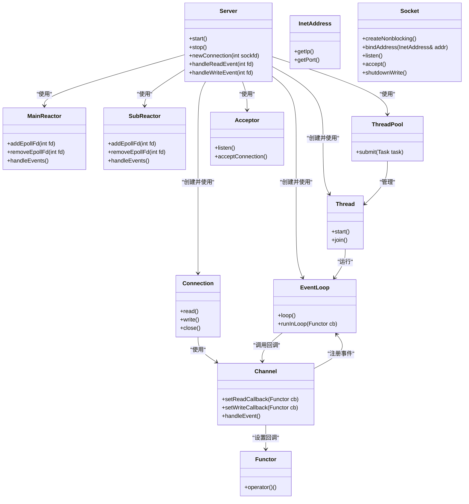
```mermaid
classDiagram
    class MainReactor {
        +addEpollFd(int fd)
        +removeEpollFd(int fd)
        +handleEvents()
    }

    class SubReactor {
        +addEpollFd(int fd)
        +removeEpollFd(int fd)
        +handleEvents()
    }

    class Server {
        +start()
        +stop()
        +newConnection(int sockfd)
        +handleReadEvent(int fd)
        +handleWriteEvent(int fd)
    }

    class Connection {
        +read()
        +write()
        +close()
    }

    class EventLoop {
        +loop()
        +runInLoop(Functor cb)
    }

    class Thread {
        +start()
        +join()
    }

    class ThreadPool {
        +submit(Task task)
    }

    class Acceptor {
        +listen()
        +acceptConnection()
    }

    class InetAddress {
        +getIp()
        +getPort()
    }

    class Socket {
        +createNonblocking()
        +bindAddress(InetAddress& addr)
        +listen()
        +accept()
        +shutdownWrite()
    }

    class Channel {
        +setReadCallback(Functor cb)
        +setWriteCallback(Functor cb)
        +handleEvent()
    }

    class Functor {
        +operator()()
    }

    Server --> MainReactor : "使用"
    Server --> SubReactor : "使用"
    Server --> ThreadPool : "使用"
    Server --> Acceptor : "使用"
    Server --> EventLoop : "创建并使用"
    Server --> Connection : "创建并使用"
    Server --> Thread : "创建并使用"
    Connection --> Channel : "使用"
    Channel --> EventLoop : "注册事件"
    Channel --> Functor : "设置回调"
    EventLoop --> Channel : "调用回调"
    ThreadPool --> Thread : "管理"
    Thread --> EventLoop : "运行"

```

- 时序图
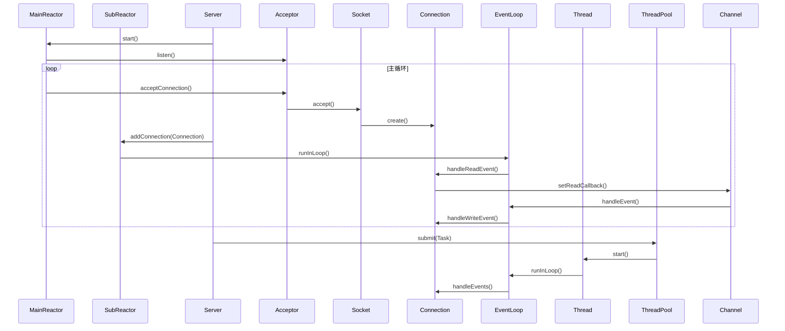
```mermaid
sequenceDiagram
    participant MainReactor
    participant SubReactor
    participant Server
    participant Acceptor
    participant Socket
    participant Connection
    participant EventLoop
    participant Thread
    participant ThreadPool

    Server->>MainReactor: start()
    MainReactor->>Acceptor: listen()
    loop 主循环
        MainReactor->>Acceptor: acceptConnection()
        Acceptor->>Socket: accept()
        Socket->>Connection: create()
        Server->>SubReactor: addConnection(Connection)
        SubReactor->>EventLoop: runInLoop()
        EventLoop->>Connection: handleReadEvent()
        Connection->>Channel: setReadCallback()
        Channel->>EventLoop: handleEvent()
        EventLoop->>Connection: handleWriteEvent()
    end
    Server->>ThreadPool: submit(Task)
    ThreadPool->>Thread: start()
    Thread->>EventLoop: runInLoop()
    EventLoop->>Connection: handleEvents()

```

- 流程图
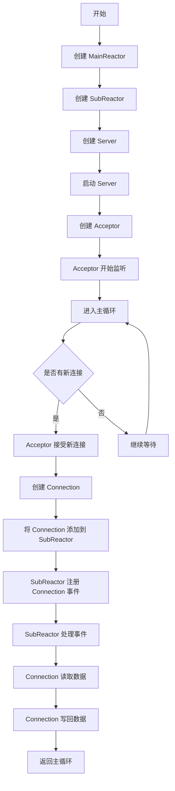
```mermaid
flowchart TD
    A[开始] --> B[创建 MainReactor]
    B --> C[创建 SubReactor]
    C --> D[创建 Server]
    D --> E[启动 Server]
    E --> F[创建 Acceptor]
    F --> G[Acceptor 开始监听]
    G --> H[进入主循环]
    H --> I{是否有新连接}
    I -->|是| J[Acceptor 接受新连接]
    J --> K[创建 Connection]
    K --> L[将 Connection 添加到 SubReactor]
    L --> M[SubReactor 注册 Connection 事件]
    M --> N[SubReactor 处理事件]
    N --> O[Connection 读取数据]
    O --> P[Connection 写回数据]
    P --> Q[返回主循环]
    I -->|否| R[继续等待]
    R --> H

```
## day13
工程化，使用cmake构建工程，使用google格式
- 设置CMakeLists.txt
  - set(CMAKE_EXPORT_COMPILE_COMMANDS ON)需设置在project()之前，否则无法生成compile_commands.json文件。同时需注意ide（vscode）是否设置默认clang-tidy  compile_commands规则，否则compile_commands.json不会生效
- 设置build_support 
  build support中包含几个python脚本
  - windows转linux会造成格式错误，需设置CRLF为LF，同时设置\r\n为\n(windows与linux换行符不同)，导致python脚本无法运行
  - Ubuntu系统未设置python环境，需手动调整/usr/bin/python3为python
>bug依旧存在，随着项目越来越大，debug开始变得困难
  

## day14
重构connection，将echo操作拆分出来支持业务逻辑自定义，消息发送通过server中lambda表达式实现
更新Server类，使其可以设置非阻塞模式。
重构后的connection,WriteNonBlocking方法
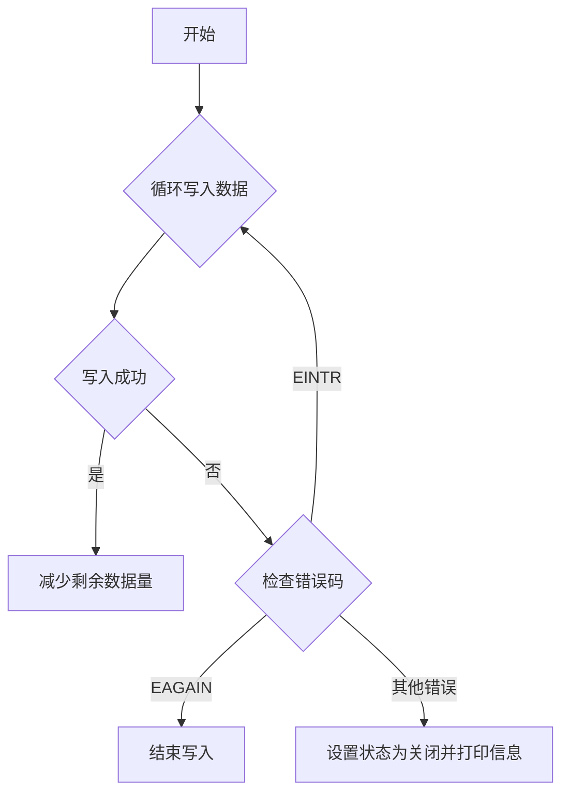
```mermaid
flowchart TD
    A[开始] --> B{循环写入数据}
    B --> C{写入成功}
    C -->|是| D[减少剩余数据量]
    C -->|否| E{检查错误码}
    E -->|EINTR| B
    E -->|EAGAIN| F[结束写入]
    E -->|其他错误| G[设置状态为关闭并打印信息]

```
重构后的Server类
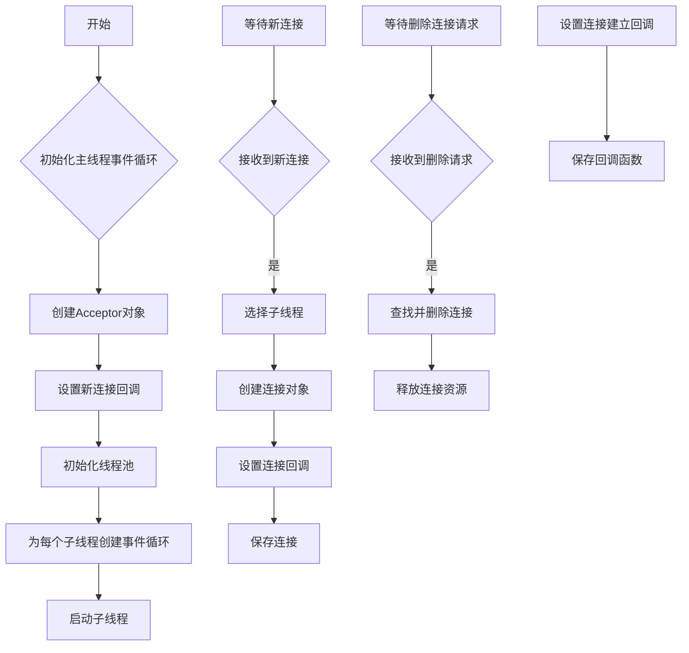
```mermaid
flowchart TD
    A[开始] --> B{初始化主线程事件循环}
    B --> C[创建Acceptor对象]
    C --> D[设置新连接回调]
    D --> E[初始化线程池]
    E --> F[为每个子线程创建事件循环]
    F --> G[启动子线程]

    H[等待新连接] --> I{接收到新连接}
    I -->|是| J[选择子线程]
    J --> K[创建连接对象]
    K --> L[设置连接回调]
    L --> M[保存连接]

    N[等待删除连接请求] --> O{接收到删除请求}
    O -->|是| P[查找并删除连接]
    P --> Q[释放连接资源]

    R[设置连接建立回调] --> S[保存回调函数]

```
## day15
添加macOS支持，使用Poller代替Epoll
Poller控制流图
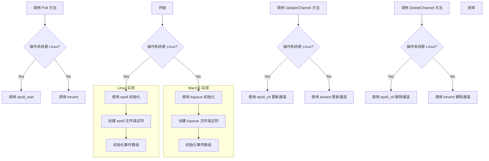
```mermaid
flowchart TD
    A[开始] --> B{操作系统是 Linux?}
    B -->|Yes| C[使用 epoll 初始化]
    B -->|No| D[使用 kqueue 初始化]

    subgraph Linux 实现
    C --> E[创建 epoll 文件描述符]
    E --> F[初始化事件数组]
    end

    subgraph MacOS 实现
    D --> G[创建 kqueue 文件描述符]
    G --> H[初始化事件数组]
    end

    I[调用 Poll 方法] --> J{操作系统是 Linux?}
    J -->|Yes| K[调用 epoll_wait]
    J -->|No| L[调用 kevent]

    M[调用 UpdateChannel 方法] --> N{操作系统是 Linux?}
    N -->|Yes| O[使用 epoll_ctl 更新通道]
    N -->|No| P[使用 kevent 更新通道]

    Q[调用 DeleteChannel 方法] --> R{操作系统是 Linux?}
    R -->|Yes| S[使用 epoll_ctl 删除通道]
    R -->|No| T[使用 kevent 删除通道]

    U[结束]

```


1. **初始化**：
   - 根据操作系统选择不同的多路复用机制（`epoll` 或 `kqueue`），并初始化文件描述符和事件数组。

2. **Poll 方法**：
   - 等待事件发生，并返回就绪的通道列表。根据操作系统调用不同的系统调用（`epoll_wait` 或 `kevent`）。

3. **UpdateChannel 方法**：
   - 更新或添加通道到多路复用器中。根据操作系统调用不同的系统调用（`epoll_ctl` 或 `kevent`）。

4. **DeleteChannel 方法**：
   - 从多路复用器中删除通道。根据操作系统调用不同的系统调用（`epoll_ctl` 或 `kevent`）。

